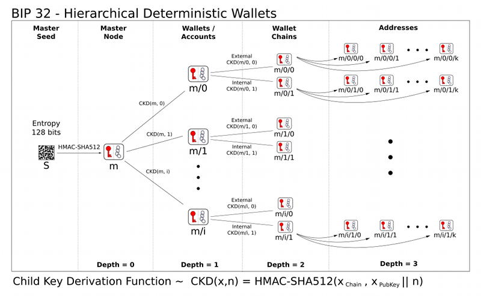

[](https://github.com/akarve/bipsea/actions)

# `bipsea`: secure entropy for Bitcoin seeds, general passwords, and other secrets

> _One Seed to rule them all,  
> One Key to find them,  
> One Path to bring them all,  
> And in cryptography bind them._  
> -[BIP-85](https://github.com/bitcoin/bips/blob/master/bip-0085.mediawiki)

bipsea is a standalone, test-driven implementation of BIP-32, BIP-39, and BIP-85.
bipsea is designed for readability and correctness.
bipsea offers a command-line interface and an API.
**bipsea is currently for experimental purposes only.**

bipsea relies on cryptographic primitives from Python
and the [python-ecdsa](https://github.com/tlsfuzzer/python-ecdsa) module, which
is [vulnerable to side-channel attacks](https://github.com/tlsfuzzer/python-ecdsa?tab=readme-ov-file#security).
bipsea does not rely on third-party libraries from any wallet vendor.

You can run bipsea offline to generate general-use passwords, Bitcoin seed words,
and more. Consider dedicated cold hardware that runs [Tails](https://tails.net),
has networking disabled, and disables
[Intel Management Engine](https://support.system76.com/articles/intel-me/)
and other possible hardware backdoors.

# How is this useful?

BIP-85 enables you to protect and store a _single_ master secret
that can derive _millions of independent, multi-purpose secrets_. 

BIP-85 offers the following benefits:

* The security of numerous independent passwords with the operational efficiency
of a single master password. (The master secret can be multi-factor.)
* Uses Bitcoin's well-tested hierarchical deterministic wallet
tree (including primitives like ECDSA and hardened children)
* Can generate millions of new mnemonic seed words and master keys
* Can generate millions of new passwords from a single master root key
(as an extended private key (xprv)
and a short derivation path.

Unlike a password manager, which protects many secrets with one hot secret,
BIP-85 _derives_ many secrets from one protected secret. Therefore you only need
to back up the derivation paths and the services they are for. You do not need to
back up the derived secrets.

You could safely store all derivation paths in a hot password manager like Apple Keychain.
You could even store the derived secrets in a hot password manager at no risk to
the master private key.

> Note: bipsea alone is not password manager, but you could use it to implement one.
> See [BIP-?: General secrets keychain with semantic derivation paths](https://github.com/akarve/bip-keychain)
> for more.


General secrets keychain with semantic derivation paths

# How does it work?

The root of your BIP-85 password tree is an extended master private key (xprv).

> In general, you _should not use a wallet seed with funds in it_.
> In any case, fresh seeds are free and easy to generate with bipsea.

The master key is then derived according to BIP-32 hierarchical deterministic
wallets with a clever twist:
the derivation path includes a purpose code (`83696968'`) followed by an _application_
code. In this way, each unique derivation path produces unique, independent,
and secure _derived entropy_ as a pure function of the master private key and
derivation path.

BIP-85 specifies a variety of application codes including the following:

| application code | description |
|------------------|-------------|
| `39'`            | as in BIP-39, to generate seed words |
| `2'`             | for HD-Seed wallet import format ([WIF](https://en.bitcoin.it/wiki/Wallet_import_format)) |
| `32'`            | as in BIP-32, to generate extended private keys (xprv) |
| `128169'`        | for 16 to 64 bytes of random hex |
| `707764'`        | for 20 to 86 characters of a base64 password |
| `707785'`        | for 10 to 80 characters of a base85 password |

bipsea implements all of the above applications plus the BIP-85 discrete random
number generator (DRNG). bipsea does not implement the RSA application codes from
BIP-85 but you could potentially use the DRNG for RSA and similar applications.

## Example derivation

Consider `m/83696968'/707764'/10'/0'`. It produces the password
`dKLoepugzd` according to the following logic:

| path segment | description                               |
|--------------|-------------------------------------------|
| `m`          | master private key                        |
| `83696968'`  | purpose code for BIP-85                   |
| `707764'`    | application code for base64 password      |
| `10'`        | number of password characters             |
| `0'`         | index, 0 to 2³¹ - 1 for millions of unique passwords |

> `'` denotes hardened child derivation, recommended for all BIP-85 applications.
_Hardened_ derivation means that, even if both the parent public key and the child
private key are exposed, the parent private key remains secure.

## BIP-32 hierarchical deterministic wallet tree



## How do I know the bipsea implementation is correct?

bipsea passes all BIP-32, BIP-39, and BIP-85 test vectors in all BIP-39 languages
and further passes its own unit tests.

There is a single BIP-85 vector, part of which xfails.
We have filed this issue to BIP-85 [here](https://github.com/bitcoin/bips/pull/1600).

Run `make test` for details.

# Usage

```
pip install bipsea
```
```
bipsea --help
```

## `bipsea seed` (BIP-39)


### New seed words

```sh
bipsea seed -t eng -n 12 --pretty
```
    1) crumble
    2) shallow
    3) hair
    4) federal
    5) cycle
    6) grid
    7) million
    8) twist
    9) turn
    10) verb
    11) orphan
    12) suggest


### xprv from existing seed words

```
bipsea seed -f eng -u "airport letter idea forget broccoli prefer panda food delay struggle ridge salute above want dinner"
```
    xprv9s21ZrQH143K3YwuXcacSSghcUfrrEyj9hTHU3a2gmr6SzPBaxmuTgKGBWtFdnnCjwGYMkU7mLvxba8FFPGLQUMvyACZTEdSCJ8uBwh5Aqs


The default switch `--strict` ensures that the input words are from the BIP-39
list and have a valid checksum.


## xprv from dice rolls (or any string)

```
bipsea seed -f any -u "123456123456123456"
```

    Warning: Relative entropy of input seems low (0.18). Consider more complex --input.
    xprv9s21ZrQH143K34TY441MbRNwzpXPfkXenXeh9VgnC74Asy19YMC1uwvxCBb1z339w8DC1P7GD5GzJPsRXMwsMcygYaG7wZwVstpVhhZR6gK

You can even load the input from a file.

```
bipsea seed -f any -u "$$(cat README.md)"
```

If you are now thinking, _I could use any string to derive a master key_,
then you're ready to learn about BIP-85 with `bipsea entropy`.

> **Do not get cute and derive valuable keys or secrets from short
> strings**. You can only stretch entropy so far.
> **Weak entropy in, weak entropy out**.
> Short, common strings are also susceptible to
[rainbow table attacks](https://en.wikipedia.org/wiki/Rainbow_table).


## `bipsea entropy` (BIP-32, BIP-85)

`bipsea entropy` requires you to pipe in an xprv, or provide an xprv with `--input`.
This xprv input is your master secret from which BIP-85 derives all child secrets
with no danger of compromising the root (or any parent key in the derivation).


### Derive new seed words

```
bipsea seed | bipsea entropy
```
    bounce cannon owner banner engine biology lava second tribe aim amused myth verify render almost siren hire laugh fruit canyon sting infant era system

Of course the above is not reproducible (because `bipsea seed` defaults to a random
seed), but you can provide a fixed master secret for consistent derivations.

```
bipsea seed -f eng -u "load kitchen smooth mass blood happy kidney orbit used process lady sudden" | bipsea entropy -n 12
```
    medal air cube edit offer pair source promote wrap pretty rare when

Append `-i 1` (the next index above the default of `-i 0`) for new words.

```
bipsea seed -f eng -u "load kitchen smooth mass blood happy kidney orbit used process lady sudden" | bipsea entropy -n 12 -i 1
```

    run sea prison modify december any pottery melody aspect hero loan gown

And so on for millions of possible child indexes.


### base64 password

```
bipsea seed -f any -u "satoshi nakamoto" | bipsea entropy -a base85 -n 10
```
    pdHd=DQk9z

Increment the child index for a unique fresh secret.

```
bipsea seed -f any -u "satoshi nakamoto" | bipsea entropy -a base85 -n 10 -i 1
```
    W>SGVF(=V6

You can pipe in an existing xprv.

```
echo "$XPRV" | bipsea entropy -a base85 -n 10
```

Or you can use `--input`.

```
bipsea entropy -a base85 -n 10 --input "$XPRV"
```


### DRNG, enter the matrix

```
bipsea seed -t xprv | bipsea entropy -a drng -n 10000
```
    <10K hex chars from the DRNG>


# ECDSA for the curious and paranoid

BIP-85 derives the entropy for each application by computing an HMAC of the private
ECDSA key of the last hardened child. Private child keys are pure functions of the
parent key, child index, and depth. In this way BIP-85 entropy is hierarchical,
deterministic, and irreversibly hardened as long as ECDSA remains secure.
ECDSA is believed to be secure but it may not even be possible to _prove_ the security
of _any_ cryptographic algorithm as such a proof would need to demonstrate strong
conjectures similar to "P is not equal to NP."

All of that to say **even the "most secure" algorithms are vulnerable to the**
**problem of induction**:
> Just because no one _has_ broken ECDSA  
> doesn't mean no one _will_ break ECDSA.

"break" means the ability to derive a private key from the corresponding
public key, a feat believed but not known to be infeasible in polynomial time
because it requires the attacker to compute the discrete logarithm of the public
key `p = Q*k`, where `Q` is the generator of the `SECP256k1` elliptic curve and
`k` is the private key. `SECP256k1` is a cyclic group under addition modulo `n`,
the order of the curve. We call computing `k` from `Q*k` the "discrete logarithm"
since, the same way `log(a^x) = x` the attacker must reduce the point `Q*k` to `k`.

ECDSA is not [post-quantum secure](https://blog.cloudflare.com/pq-2024).
If someone were to build a so-far elusive quantum computer with sufficiently many
logical q-bits to run Shor's algorithm to compute the discrete log of an ECDSA
private key, ECDSA would be broken.
As unlikely as a quantum computer may seem, the Chromium team is
[taking no chances](https://blog.chromium.org/2024/05/advancing-our-amazing-bet-on-asymmetric.html)
and has begun to roll out quantum-resistant changes to SSL.


# Developer

```
make install
make install-go
make test
```

See [Makefile](./Makefile) for more commands.


# References

1. [BIP-32](https://github.com/bitcoin/bips/blob/master/bip-0032.mediawiki) hierarchical deterministic wallets

1. [BIP-39](https://github.com/bitcoin/bips/blob/master/bip-0039.mediawiki) mnemonic seed words

1. [BIP-44](https://github.com/bitcoin/bips/blob/master/bip-0044.mediawiki)
generalized BIP-32 paths

1. [BIP-85](https://github.com/bitcoin/bips/blob/master/bip-0085.mediawiki) generalized cryptographic entropy


# TODO

* [ ] Investigate switch to secure ECDSA libs with constant-time programming and
side-channel resistance.
    * [ ] https://cryptography.io/en/latest/
